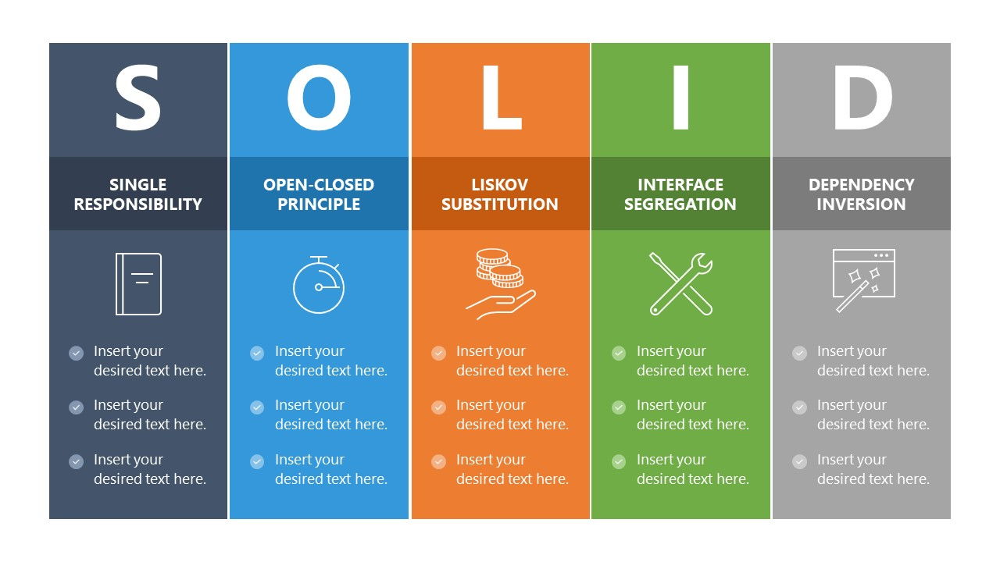

# 🌟 PRINCIPIOS SOLID 🌟

Los principios SOLID son una herramienta importante para el desarrollo de software de calidad. Al seguir estos principios, los desarrolladores pueden crear código que sea:

* Ligero: El código que sigue los principios SOLID es más fácil de entender y mantener.

* Extensible: El código que sigue los principios SOLID es más fácil de extender con nuevas funcionalidades.

* Reutilizable: El código que sigue los principios SOLID es más fácil de reutilizar en otros proyectos.

# INDICE

1. [¿ QUÉ SON LOS PRINCIPIOS SOLID ?](#🎇-¿-qué-son-los-principios-solid--🎇)

2. 

# 🎇 ¿ QUÉ SON LOS PRINCIPIOS SOLID ? 🎇

Los principios SOLID son un conjunto de cinco principios de diseño de software que se utilizan para crear un código más limpio, mantenible y extensible. Los principios fueron introducidos por Robert C. Martin en su libro "Agile Software Development, Principles, Patterns, and Practices".

Los cinco principios SOLID son:

* Single Responsibility Principle (SRP): Cada clase debe tener una sola responsabilidad.

* Open/Closed Principle (OCP): Las clases deben estar abiertas para la extensión, pero cerradas para la modificación.

* Liskov Substitution Principle (LSP): Las clases derivadas deben ser sustituibles por sus clases base.

* Interface Segregation Principle (ISP): Las interfaces deben estar bien segregadas.

* Dependency Inversion Principle (DIP): Las dependencias deben ir de lo general a lo específico.

# 🍤 Single Responsibility Principle (SRP) 🍤

El Single Responsibility Principle (SRP) o Principio de Responsabilidad Única es un principio de diseño de software que establece que cada clase debe tener una sola responsabilidad. Esto significa que una clase debe ser responsable de una sola tarea o función.

El SRP es un principio importante porque ayuda a crear código más limpio, mantenible y extensible. Si una clase tiene una sola responsabilidad, es más fácil de entender y modificar. Además, es más fácil agregar nuevas funcionalidades a una clase si tiene una sola responsabilidad.

*Ejemplos*

A continuación se muestran algunos ejemplos de clases que violan el SRP:

* Una clase que representa a un usuario y que también contiene métodos para enviar correos electrónicos y para guardar información en una base de datos.

* Una clase que representa a un producto y que también contiene métodos para calcular el precio del producto y para generar una factura.

* Una clase que representa a un rectángulo y que también contiene métodos para calcular el área del rectángulo y para dibujar el rectángulo.

*Cómo aplicar el SRP*

Para aplicar el SRP, se puede dividir una clase en varias clases más pequeñas, cada una de las cuales tiene una sola responsabilidad. Por ejemplo, la clase que representa al usuario se puede dividir en tres clases: una clase para representar al usuario, una clase para enviar correos electrónicos y una clase para guardar información en una base de datos.

Otra forma de aplicar el SRP es utilizar interfaces. Una interfaz es un contrato que define la funcionalidad que debe proporcionar una clase. Por ejemplo, se puede crear una interfaz para calcular el área de una figura geométrica. Luego, se pueden crear clases que implementen esta interfaz y calculen el área de diferentes figuras geométricas, como rectángulos, círculos y triángulos.

*Beneficios de aplicar el SRP*

Aplicar el SRP tiene varios beneficios, incluyendo:

* El código es más fácil de entender y mantener.

* El código es más extensible.

* El código es más reutilizable.

* El código es menos propenso a errores.

# 🍤 Open/Closed Principle (OCP) 🍤

El Open/Closed Principle (OCP) o Principio de Abierto/Cerrado es un principio de diseño de software que establece que las clases deben estar abiertas para la extensión, pero cerradas para la modificación. Esto significa que las clases deben ser diseñadas de manera que se puedan agregar nuevas funcionalidades sin modificar la clase existente.

El OCP es un principio importante porque ayuda a crear código más mantenible y extensible. Si una clase está cerrada para la modificación, es menos probable que se introduzcan errores al agregar nuevas funcionalidades. Además, el OCP facilita la incorporación de nuevos desarrolladores a un proyecto, ya que no necesitan comprender toda la clase para agregar nuevas funcionalidades.

*Ejemplos*

A continuación se muestran algunos ejemplos de clases que violan el OCP:

* Una clase que representa a un rectángulo y que tiene un método para calcular el área del rectángulo. Si se necesita agregar la funcionalidad para calcular el área de un círculo, el método para calcular el área del rectángulo deberá modificarse.

* Una clase que representa a un usuario y que tiene un método para enviar correos electrónicos. Si se necesita agregar la funcionalidad para enviar mensajes SMS, el método para enviar correos electrónicos deberá modificarse.

* Una clase que representa a un producto y que tiene un método para calcular el precio del producto. Si se necesita agregar la funcionalidad para aplicar un descuento al precio del producto, el método para calcular el precio del producto deberá modificarse.

*Cómo aplicar el OCP*

Para aplicar el OCP, se pueden utilizar las siguientes técnicas:

* Heredabilidad: Se puede crear una clase base que defina la funcionalidad común. Luego, se pueden crear clases derivadas que implementen la funcionalidad específica para cada tipo de objeto. Por ejemplo, se puede crear una clase base que represente a una figura geométrica y que tenga un método para calcular el área de la figura. Luego, se pueden crear clases derivadas para representar rectángulos, círculos y triángulos.

* Composición: Se puede utilizar la composición para crear objetos complejos a partir de objetos más simples. Por ejemplo, en lugar de crear una clase que represente a un producto y que tenga un método para calcular el precio del producto, se puede crear una clase que represente a un producto y una clase que represente al precio del producto. Luego, se puede crear una composición entre estas dos clases para crear un objeto que represente a un producto con un precio.

* Interfaces: Se pueden utilizar interfaces para definir la funcionalidad que debe proporcionar una clase sin especificar cómo se implementa esa funcionalidad. Esto permite que las clases se implementen de diferentes maneras sin afectar a las clases que dependen de ellas. Por ejemplo, se puede crear una interfaz para calcular el área de una figura geométrica. Luego, se pueden crear clases que implementen esta interfaz y calculen el área de diferentes figuras geométricas, como rectángulos, círculos y triángulos.

*Beneficios de aplicar el OCP*

Aplicar el OCP tiene varios beneficios, incluyendo:

* El código es más mantenible.

* El código es más extensible.

* El código es menos propenso a errores.

* El código es más fácil de entender.

# 🍤 Liskov Substitution Principle (LSP) 🍤

El Liskov Substitution Principle (LSP) o Principio de Sustitución de Liskov establece que las clases derivadas deben ser sustituibles por sus clases base sin afectar al funcionamiento de la aplicación. Esto significa que una clase derivada debe poder utilizarse en lugar de su clase base sin que esto provoque errores o resultados inesperados.

El LSP es un principio importante porque ayuda a crear código más robusto y confiable. Si una clase derivada no es sustituible por su clase base, es posible que el código que depende de la clase base no funcione correctamente si se utiliza una instancia de la clase derivada.

*Ejemplos*

A continuación se muestran algunos ejemplos de clases que violan el LSP:

* Una clase base que representa a un rectángulo y que tiene un método para calcular el área del rectángulo. Una clase derivada de esta clase podría representar a un cuadrado, que es un tipo especial de rectángulo. Sin embargo, el método para calcular el área del cuadrado no sería el mismo que el método para calcular el área del rectángulo. Por lo tanto, el cuadrado no sería sustituible por el rectángulo.

* Una clase base que representa a un animal y que tiene un método para volar. Una clase derivada de esta clase podría representar a un pingüino, que es un tipo de animal que no puede volar. Sin embargo, el método para volar estaría presente en la clase derivada, incluso si no se puede utilizar. Por lo tanto, el pingüino no sería sustituible por el animal.

* Una clase base que representa a una forma de pago y que tiene un método para realizar un pago. Una clase derivada de esta clase podría representar a una tarjeta de crédito, que es un tipo de forma de pago que tiene un límite de crédito. Sin embargo, el método para realizar un pago no sería el mismo para la tarjeta de crédito que para la clase base. Por lo tanto, la tarjeta de crédito no sería sustituible por la forma de pago.

*Cómo aplicar el LSP*

Para aplicar el LSP, se deben seguir las siguientes pautas:

* Las clases derivadas deben implementar todas las operaciones de sus clases base.

* Las clases derivadas no deben modificar el comportamiento de las operaciones de sus clases base.

* Las clases derivadas deben preguardar el comportamiento de las operaciones de sus clases base.

*Beneficios de aplicar el LSP*

Aplicar el LSP tiene varios beneficios, incluyendo:

* El código es más robusto y confiable.

* El código es más fácil de mantener.

* El código es más fácil de extender.

* El código es menos propenso a errores.

# 🍤 Interface Segregation Principle (ISP) 🍤

El Interface Segregation Principle (ISP) o Principio de Segregación de Interfaces establece que las interfaces deben estar bien segregadas. Esto significa que las interfaces deben diseñarse de manera que se adapten a las necesidades de los clientes.

El ISP es un principio importante porque ayuda a crear código más flexible y reutilizable. Si una interfaz está bien segregada, los clientes solo tendrán que implementar las partes de la interfaz que necesitan. Esto facilita el desarrollo de nuevos componentes y la modificación de componentes existentes.

*Ejemplos*

A continuación se muestran algunos ejemplos de interfaces que violan el ISP:

* Una interfaz para una impresora que tiene métodos para imprimir documentos, escanear documentos y enviar faxes. Sin embargo, es posible que algunos clientes solo necesiten imprimir documentos y otros clientes solo necesiten escanear documentos.

* Una interfaz para un usuario que tiene métodos para iniciar sesión, registrarse, editar su perfil y realizar compras. Sin embargo, es posible que algunos clientes solo necesiten iniciar sesión y editar su perfil.

* Una interfaz para un vehículo que tiene métodos para acelerar, frenar, girar y aparcar. Sin embargo, es posible que algunos clientes solo necesiten acelerar y frenar.

*Cómo aplicar el ISP*

Para aplicar el ISP, se pueden dividir las interfaces grandes en interfaces más pequeñas y específicas. Por ejemplo, la interfaz para la impresora se puede dividir en tres interfaces: una interfaz para imprimir documentos, una interfaz para escanear documentos y una interfaz para enviar faxes.

Otra forma de aplicar el ISP es utilizar interfaces por rol. Una interfaz por rol es una interfaz que define la funcionalidad que necesita un tipo de usuario específico. Por ejemplo, se puede crear una interfaz para el rol de administrador y una interfaz para el rol de usuario. La interfaz para el rol de administrador contendría métodos para crear nuevos usuarios, eliminar usuarios y modificar permisos de acceso. La interfaz para el rol de usuario contendría métodos para iniciar sesión, editar su perfil y realizar compras.

*Beneficios de aplicar el ISP*

Aplicar el ISP tiene varios beneficios, incluyendo:

* El código es más flexible y reutilizable.

* El código es más fácil de entender y mantener.

* El código es menos propenso a errores.

# 🍤 Dependency Inversion Principle (DIP) 🍤 

El Dependency Inversion Principle (DIP) o Principio de Inversión de Dependencias establece que las dependencias deben ir de lo general a lo específico. Esto significa que las clases de alto nivel no deben depender de clases de bajo nivel, sino que las clases de bajo nivel deben depender de abstracciones.

El DIP es un principio importante porque ayuda a crear código más flexible y mantenible. Si las clases de alto nivel dependen de clases de bajo nivel, es más difícil modificar o reemplazar las clases de bajo nivel sin afectar a las clases de alto nivel.

*Ejemplos*

A continuación se muestran algunos ejemplos de clases que violan el DIP:

* Una clase que representa a un usuario y que depende de una clase específica para acceder a la base de datos. Si se necesita cambiar de base de datos, la clase que representa al usuario también deberá modificarse.

* Una clase que representa a un producto y que depende de una clase específica para calcular el precio del producto. Si se necesita cambiar la fórmula para calcular el precio del producto, la clase que representa al producto también deberá modificarse.

* Una clase que representa a una interfaz de usuario y que depende de una clase específica para dibujar los botones y otros elementos de la interfaz de usuario. Si se necesita cambiar el aspecto de la interfaz de usuario, la clase que representa a la interfaz de usuario también deberá modificarse.

*Cómo aplicar el DIP*

Para aplicar el DIP, se pueden utilizar las siguientes técnicas:

* Abstracciones: Se pueden utilizar abstracciones para definir la funcionalidad que necesitan las clases de alto nivel sin especificar cómo se implementa esa funcionalidad. Por ejemplo, se puede crear una interfaz para acceder a la base de datos. Luego, se puede crear una clase que implemente esta interfaz y acceda a la base de datos de forma específica.

* Inyección de dependencias: La inyección de dependencias es una técnica de diseño de software que permite a las clases de alto nivel recibir sus dependencias de las clases de bajo nivel en lugar de crearlas ellas mismas. Esto facilita la modificación o el reemplazo de las clases de bajo nivel sin afectar a las clases de alto nivel.

*Beneficios de aplicar el DIP*

Aplicar el DIP tiene varios beneficios, incluyendo:

* El código es más flexible y mantenible.

* El código es más fácil de probar.

* El código es más reutilizable.

