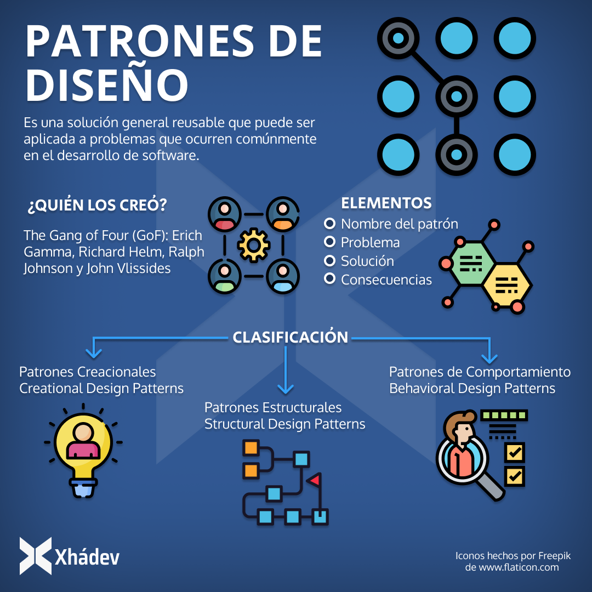

# 🧑‍💻 PATRONES DE DISEÑO 🧑‍💻


El desarrollo de software es un proceso complejo que requiere la aplicación de diferentes técnicas y herramientas. Los patrones de diseño son una de estas herramientas que pueden ayudar a los desarrolladores a diseñar sistemas de software más eficientes y fáciles de mantener.

# INDICE

1. [PATRONES DE DISEÑO](#👨‍💻-patrones-de-diseño-👨‍💻)

2. [TIPOS DE PATRONES DE DISEÑO](#🌠-tipos-de-patrones-de-diseño-🌠)


    2.1 [PATRONES CREACIONALES](#🎢-patrones-creacionales)
        
    - 2.1.1 [PATRON FACTORY METHOD](#🚧-patron-factory-method)
    
    - 2.1.2 [PATRON ABSTRAC FACTORY](#🚧-patron-abstrac-factory)

    - 2.1.3 [PATRON SINGLETON](#🚧-patron-singleton)

    - 2.1.4 [PATRON BUILDER](#🚧-patron-builder)

    - 2.1.5 [PATRON PROTOTYPE](#🚧-patron-prototype)

    - 2.1.6 [PATRON OBJECT COOL](#🚧-patron-object-pool)

    2.2 [PATRONES ESTRUCTURALES](#🎢-patrones-estructurales)

    - 2.2.1 [PATRON ADAPTER](#🚧-patron-adapter)

    - 2.2.2 [PATRON BRIDGE](#🚧-patron-bridge)

    - 2.2.3 [PATRON COMPOSITE](#🚧-patron-composite)

    - 2.2.4 [PATRON DECORATOR](#🚧-patron-decorator)

    - 2.2.5 [PATRON FACADE](#🚧-patron-facade)

    - 2.2.6 [PATRON FLYWEIGHT](#🚧-patron-flyweight)

    - 2.2.7 [PATRON PROXY](#🚧-patron-proxy)

    2.3 [PATRONES DE COMPORTAMIENTO](#🎢-patrones-de-comportamineto)

    - 2.3.1 [PATRON ITERATOR](#🚧-patron-iterator)

    - 2.3.2 [PATRON COMMAND](#🚧-patron-command)

    - 2.3.3 [PATRON OBSERVER](#🚧-patron-observer)

    - 2.3.4 [PATRON TEMPLATE METHOD](#🚧-patron-template-method)

    - 2.3.5 [PATRON STRATEGY](#🚧-patron-strategy)

    - 2.3.6 [PATRON CHAIN OF RESPONSABILITY](#🚧-patron-chain-of-reponsability)

    - 2.3.7 [PATRON INTERPRETER](#🚧-patron-interpreter)

    - 2.3.8 [PATRON MEDIATOR](#🚧-patron-mediator)

    - 2.3.9 [PATRON MEMENTO](#🚧-patron-memento)

    - 2.3.10 [PATRON NULL-OBJECT](#🚧-patron-null-object)

    - 2.3.11 [PATRON STATE](#🚧-patron-state)

    - 2.3.12 [PATRON VISITOR](#🚧-patron-visitor)

# 👨‍💻 PATRONES DE DISEÑO 👨‍💻

Los patrones de diseño en la arquitectura de software son soluciones generales y reutilizables a problemas comunes en la arquitectura de software. Son similares a los patrones de diseño de software, pero tienen un alcance más amplio.

Los patrones de diseño se centran en la resolución de problemas comunes en el diseño de software. Se centran en la estructura y el comportamiento de los componentes individuales de un sistema.}




Algunos ejemplos de patrones de diseño son:

🛰️ *Factory:* 

Este patrón proporciona una forma de crear objetos sin exponer la lógica de creación.

🛰️ *Singleton:* 

Este patrón garantiza que solo haya una instancia de una clase en un sistema.

🛰️ *Adapter:* 

Este patrón permite que dos clases que no son compatibles se comuniquen entre sí.

# 🌠 TIPOS DE PATRONES DE DISEÑO 🌠

## 	🎢 PATRONES CREACIONALES


Los patrones de diseño creacionales son un tipo de patrón de diseño que se centra en la creación de objetos. Estos patrones se utilizan para resolver problemas relacionados con la creación de objetos, como la creación de objetos de manera eficiente, la creación de objetos de manera flexible y la creación de objetos de manera condicional.

Ventajas de los patrones creacionales:

* Flexibilidad: Los patrones creacionales permiten crear objetos de una manera flexible.

* Eficiencia: Los patrones creacionales pueden ayudar a crear objetos de manera eficiente.

* Mantenimiento: Los patrones creacionales pueden ayudar a hacer que el código sea más fácil de mantener.

Desventajas de los patrones creacionales:

* Complejidad: Los patrones creacionales pueden agregar complejidad al código.

* Eficiencia: Los patrones creacionales pueden reducir la eficiencia en algunos casos.
<br>

### 🚧 PATRON FACTORY METHOD


El patrón Factory Method (Método Fábrica) es un patrón de diseño creacional que proporciona una interfaz para crear objetos en una superclase, pero permite a las subclases alterar el tipo de objetos que se crearán.

En otras palabras, el patrón Factory Method permite que las subclases decidan qué clase de objeto crear, sin tener que especificar su clase exacta en la superclase. Esto hace que el código sea más flexible y extensible, ya que las subclases pueden añadir nuevos tipos de objetos sin tener que modificar la superclase.

El patrón Factory Method se implementa de la siguiente manera:

1. Se define una clase abstracta o interfaz llamada Factory que declara un método createProduct(). Este método devuelve un objeto de un tipo concreto, pero el tipo de objeto puede ser diferente en cada subclase.

2. Se definen clases concretas que heredan de la clase Factory e implementan el método createProduct(). Cada subclase devuelve un objeto de un tipo diferente.

3. Las clases que necesitan crear objetos de un tipo concreto utilizan el método createProduct() de la clase Factory correspondiente.

EJEMPLO:

```js
class Product {
  constructor(name) {
    this.name = name;
  }

  sayHello() {
    return `Hello, I am ${this.name}`;
  }
}

class ConcreteProductA extends Product {
  constructor() {
    super("Product A");
  }
}

class ConcreteProductB extends Product {
  constructor() {
    super("Product B");
  }
}

class Factory {
  static createProduct(type) {
    switch (type) {
      case "A":
        return new ConcreteProductA();
      case "B":
        return new ConcreteProductB();
      default:
        throw new Error("Invalid product type");
    }
  }
}

const productA = Factory.createProduct("A");
console.log(productA.sayHello()); // Hello, I am Product A

const productB = Factory.createProduct("B");
console.log(productB.sayHello()); // Hello, I am Product B
```
<br>
En este ejemplo, la clase Product define la interfaz para crear objetos. Las clases concretas ConcreteProductA y ConcreteProductB heredan de la clase Product e implementan la lógica específica de cada producto.

La clase Factory define un método createProduct() que devuelve un objeto de un tipo concreto, en función del parámetro type. Este método utiliza un switch para determinar el tipo de objeto que debe crear.

La función main() crea una instancia de cada clase Factory e invoca el método createProduct(). Esto devuelve un objeto de tipo ConcreteProductA o ConcreteProductB, dependiendo del parámetro type que se utilizó.

El patrón Factory Method es un patrón de diseño muy útil que se puede utilizar en una variedad de situaciones. En JavaScript, este patrón se puede utilizar para crear objetos de diferentes tipos en función de la configuración de la aplicación, la plataforma en la que se ejecuta la aplicación o los permisos del usuario.<br>

### 🚧 PATRON ABSTRAC FACTORY

El patrón Abstract Factory (Fábrica Abstracta) es un patrón de diseño creacional que proporciona una interfaz para crear objetos relacionados sin especificar sus clases concretas.

En otras palabras, el patrón Abstract Factory permite que las subclases creen objetos de diferentes familias, sin tener que especificar las clases concretas de los objetos que se crearán. Esto hace que el código sea más flexible y extensible, ya que las subclases pueden añadir nuevas familias de objetos sin tener que modificar la superclase.

El patrón Abstract Factory se implementa de la siguiente manera:

1. Se define una interfaz o clase abstracta llamada AbstractFactory que declara métodos para crear objetos de cada clase de la familia de productos.

2. Se definen clases concretas que implementan la interfaz AbstractFactory. Cada clase concreta crea objetos de una familia concreta.

Las clases que necesitan crear objetos de una familia concreta utilizan los métodos de la clase AbstractFactory correspondiente.

EJEMPLO:

```js

// Interfaz abstracta
interface AbstractFactory {
  createProductA(): ProductA;
  createProductB(): ProductB;
}

// Clases concretas
class ConcreteFactoryA implements AbstractFactory {
  createProductA(): ProductA {
    return new ConcreteProductA();
  }

  createProductB(): ProductB {
    return new ConcreteProductB();
  }
}

class ConcreteFactoryB implements AbstractFactory {
  createProductA(): ProductA {
    return new ConcreteProductC();
  }

  createProductB(): ProductB {
    return new ConcreteProductD();
  }
}

// Clases de productos
class ProductA {
  sayHello() {
    return "Hello, I am a Product A";
  }
}

class ConcreteProductA extends ProductA {}

class ProductB {
  sayHello() {
    return "Hello, I am a Product B";
  }
}

class ConcreteProductB extends ProductB {}

class ConcreteProductC extends ProductA {}

class ConcreteProductD extends ProductB {}

// Ejemplo de uso
const factoryA = new ConcreteFactoryA();
const productA = factoryA.createProductA();
const productB = factoryA.createProductB();

console.log(productA.sayHello()); // Hello, I am a Product A
console.log(productB.sayHello()); // Hello, I am a Product B

const factoryB = new ConcreteFactoryB();
const productC = factoryB.createProductA();
const productD = factoryB.createProductB();

console.log(productC.sayHello()); // Hello, I am a Product C
console.log(productD.sayHello()); // Hello, I am a Product D
```

En este ejemplo, la interfaz AbstractFactory declara dos métodos: createProductA() y createProductB(). Estos métodos devuelven objetos de las clases ProductA y ProductB.

Las clases concretas ConcreteFactoryA y ConcreteFactoryB implementan la interfaz AbstractFactory. Cada clase concreta crea objetos de una familia concreta: ConcreteFactoryA crea objetos de la familia ProductA y ConcreteFactoryB crea objetos de la familia ProductB.

Las clases ProductA y ProductB definen la lógica específica de cada producto.

La función main() crea una instancia de cada clase AbstractFactory e invoca los métodos createProductA() y createProductB(). Esto devuelve un objeto de tipo ProductA o ProductB, dependiendo de la clase AbstractFactory que se utilizó.

El patrón Abstract Factory es un patrón de diseño muy útil que se puede utilizar en una variedad de situaciones en JavaScript. Este patrón se puede utilizar para crear objetos de diferentes familias en función de la configuración de la aplicación, la plataforma en la que se ejecuta la aplicación o los permisos del usuario.
<br>

### 🚧 PATRON SINGLETON


El patrón Singleton es un patrón de diseño creacional que garantiza que solo exista una instancia de una clase en un programa.

Este patrón se utiliza a menudo para acceder a recursos compartidos, como una base de datos o un archivo de configuración.

El patrón Singleton se implementa de la siguiente manera:

1. La clase Singleton declara un atributo de instancia estático llamado instance.

2. La clase Singleton declara un método estático llamado getInstance().

3. El método getInstance() devuelve la instancia de la clase Singleton.

EJEMPLO:

```js

class Singleton {
  // Atributo de instancia estático
  static instance = null;

  // Constructor privado
  constructor() {}

  // Método estático para obtener la instancia
  static getInstance() {
    if (!Singleton.instance) {
      Singleton.instance = new Singleton();
    }
    return Singleton.instance;
  }
}

// Ejemplo de uso
const instance1 = Singleton.getInstance();
const instance2 = Singleton.getInstance();

console.log(instance1 === instance2); // true

```
En este ejemplo, la clase Singleton declara un atributo de instancia estático llamado instance. Este atributo se inicializa a null en el constructor de la clase.

El método getInstance() de la clase Singleton devuelve la instancia de la clase Singleton. Si la instancia no existe, el método la crea.

El ejemplo de código crea dos instancias de la clase Singleton. Sin embargo, ambas instancias apuntan a la misma instancia de la clase Singleton.

El patrón Singleton tiene muchas ventajas:

* Garantía de unicidad: El patrón Singleton garantiza que solo exista una instancia de una clase en un programa. Esto puede ser útil para acceder a recursos compartidos.

* Reutilización de recursos: El patrón Singleton puede ayudar a reutilizar recursos compartidos.

* Mejora del rendimiento: El patrón Singleton puede mejorar el rendimiento al evitar la creación de instancias innecesarias de una clase.

El patrón Singleton también tiene algunas desventajas:

* Puede ser difícil de implementar: El patrón Singleton puede ser difícil de implementar correctamente.

* Puede ser inflexible: El patrón Singleton puede ser inflexible si se necesita crear más de una instancia de una clase.

En general, el patrón Singleton es un patrón de diseño muy útil que se puede utilizar en una variedad de situaciones.
<br>

### 🚧 PATRON BUILDER


El patrón Builder es un patrón de diseño creacional que permite crear objetos complejos de forma paso a paso.

Este patrón se utiliza a menudo para crear objetos que tienen muchos atributos o que requieren una secuencia compleja de pasos para ser creados.

El patrón Builder se implementa de la siguiente manera:

1. Se define una clase abstracta o interfaz llamada Builder que declara métodos para configurar los atributos de un objeto.

2. Se definen clases concretas que implementan la interfaz Builder. Cada clase concreta implementa los métodos de la interfaz Builder para configurar los atributos de un objeto de una manera específica.

3. Se define una clase Director que utiliza una instancia de una clase Builder para crear un objeto.

EJEMPLO:

```js
// Interfaz Builder
interface Builder {
  setBrand(brand: string): void;
  setModel(model: string): void;
  setColor(color: string): void;
  build(): Car;
}

// Clase concreta Builder
class CarBuilder implements Builder {
  private car: Car;

  constructor() {
    this.car = new Car();
  }

  setBrand(brand: string) {
    this.car.brand = brand;
  }

  setModel(model: string) {
    this.car.model = model;
  }

  setColor(color: string) {
    this.car.color = color;
  }

  build(): Car {
    return this.car;
  }
}

// Clase Director
class Director {
  private builder: Builder;

  constructor(builder: Builder) {
    this.builder = builder;
  }

  buildCar(brand: string, model: string, color: string) {
    this.builder.setBrand(brand);
    this.builder.setModel(model);
    this.builder.setColor(color);
    return this.builder.build();
  }
}

// Clase Car
class Car {
  public brand: string;
  public model: string;
  public color: string;

  constructor() {}
}

// Ejemplo de uso
const builder = new CarBuilder();
const director = new Director(builder);

const car = director.buildCar("Toyota", "Corolla", "Red");

console.log(car.brand); // Toyota
console.log(car.model); // Corolla
console.log(car.color); // Red

```


El patrón Builder es un patrón de diseño creacional que permite crear objetos complejos de forma paso a paso.

Este patrón se utiliza a menudo para crear objetos que tienen muchos atributos o que requieren una secuencia compleja de pasos para ser creados.

El patrón Builder se implementa de la siguiente manera:

Se define una clase abstracta o interfaz llamada Builder que declara métodos para configurar los atributos de un objeto.
Se definen clases concretas que implementan la interfaz Builder. Cada clase concreta implementa los métodos de la interfaz Builder para configurar los atributos de un objeto de una manera específica.
Se define una clase Director que utiliza una instancia de una clase Builder para crear un objeto.
El siguiente ejemplo muestra una implementación del patrón Builder en JavaScript:

JavaScript
// Interfaz Builder
interface Builder {
  setBrand(brand: string): void;
  setModel(model: string): void;
  setColor(color: string): void;
  build(): Car;
}

// Clase concreta Builder
class CarBuilder implements Builder {
  private car: Car;

  constructor() {
    this.car = new Car();
  }

  setBrand(brand: string) {
    this.car.brand = brand;
  }

  setModel(model: string) {
    this.car.model = model;
  }

  setColor(color: string) {
    this.car.color = color;
  }

  build(): Car {
    return this.car;
  }
}

// Clase Director
class Director {
  private builder: Builder;

  constructor(builder: Builder) {
    this.builder = builder;
  }

  buildCar(brand: string, model: string, color: string) {
    this.builder.setBrand(brand);
    this.builder.setModel(model);
    this.builder.setColor(color);
    return this.builder.build();
  }
}

// Clase Car
class Car {
  public brand: string;
  public model: string;
  public color: string;

  constructor() {}
}

// Ejemplo de uso
const builder = new CarBuilder();
const director = new Director(builder);

const car = director.buildCar("Toyota", "Corolla", "Red");

console.log(car.brand); // Toyota
console.log(car.model); // Corolla
console.log(car.color); // Red
Utiliza el código con precaución. Más información
En este ejemplo, la interfaz Builder declara tres métodos: setBrand(), setModel() y setColor(). Estos métodos se utilizan para configurar los atributos de un objeto Car.

La clase CarBuilder implementa la interfaz Builder. La clase CarBuilder utiliza atributos privados para almacenar los valores de los atributos de un objeto Car.

La clase Director utiliza una instancia de una clase Builder para crear un objeto Car. La clase Director invoca los métodos de la clase Builder para configurar los atributos del objeto Car.

El ejemplo de código crea un objeto Car con la marca Toyota, el modelo Corolla y el color Red.

El patrón Builder tiene muchas ventajas:

* Encapsulación: El patrón Builder encapsula la lógica de creación de objetos. Esto hace que el código sea más fácil de entender y mantener.

* Flexibilidad: El patrón Builder permite crear objetos complejos de forma paso a paso.

* Reusabilidad: El patrón Builder puede ser reutilizado para crear diferentes tipos de objetos.

El patrón Builder también tiene algunas desventajas:

* Puede ser complejo: El patrón Builder puede ser complejo de implementar y comprender.

* Puede ser ineficiente: El patrón Builder puede ser ineficiente si se necesita crear muchos objetos.

En general, el patrón Builder es un patrón de diseño muy útil que se puede utilizar en una variedad de situaciones.
<br>

### 🚧 PATRON PROTOTYPE

El patrón Prototype es un patrón de diseño creacional que permite crear objetos clonando un objeto existente.

Este patrón se utiliza a menudo para crear objetos que son muy similares entre sí.

El patrón Prototype se implementa de la siguiente manera:

1. Se define una clase Prototype que declara un método clone().

2. Las clases que implementan la interfaz Prototype implementan el método clone().

3. El método clone() devuelve una copia del objeto actual.

EJEMPLO:

```js

class Prototype {
  constructor(name: string) {
    this.name = name;
  }

  clone(): Prototype {
    return new Prototype(this.name);
  }
}

// Ejemplo de uso
const prototype = new Prototype("Prototype");

const clone = prototype.clone();

console.log(clone.name); // Prototype

```
En este ejemplo, la clase Prototype declara un método clone() que devuelve una copia del objeto actual.

El ejemplo de código crea un objeto Prototype con el nombre Prototype. Luego, el objeto Prototype se clona y se almacena en una variable clone.

El objeto clone tiene el mismo nombre que el objeto original.

El patrón Prototype tiene muchas ventajas:

* Eficiencia: El patrón Prototype es eficiente, ya que evita la necesidad de crear objetos desde cero.

* Flexibilidad: El patrón Prototype permite crear objetos personalizados a partir de un objeto existente.

* Reutilización de código: El patrón Prototype puede ser reutilizado para crear diferentes tipos de objetos.

El patrón Prototype también tiene algunas desventajas:

* Puede ser inflexible: El patrón Prototype puede ser inflexible si se necesita crear objetos con diferentes atributos.

En general, el patrón Prototype es un patrón de diseño muy útil que se puede utilizar en una variedad de situaciones.

En JavaScript, el patrón Prototype se puede utilizar para crear objetos que son muy similares entre sí. Por ejemplo, se puede utilizar para crear objetos de usuario, objetos de producto o objetos de configuración.

El patrón Prototype también se puede utilizar para crear objetos personalizados a partir de un objeto existente. Por ejemplo, se puede utilizar para crear objetos de prueba a partir de objetos de producción.
<br>

### 🚧 PATRON OBJECT POOL

El patrón Object Pool (Piscina de objetos) es un patrón de diseño creacional que proporciona un grupo de objetos inicializados y preparados para su uso.

Este patrón se utiliza a menudo para mejorar el rendimiento de la aplicación al evitar la necesidad de crear objetos desde cero cada vez que se necesitan.

El patrón Object Pool se implementa de la siguiente manera:

1. Se define una clase ObjectPool que contiene un conjunto de objetos.

2. La clase ObjectPool proporciona métodos para obtener y liberar objetos.

3. Las clases que implementan la interfaz ObjectPool implementan los métodos de la clase ObjectPool.

EJEMPLO:

```js 

class ObjectPool {
  constructor() {
    this.objects = [];
  }

  getObject(): Object {
    if (this.objects.length === 0) {
      this.objects.push(new Object());
    }
    return this.objects.pop();
  }

  releaseObject(object: Object) {
    this.objects.push(object);
  }
}

// Ejemplo de uso
const pool = new ObjectPool();

const object1 = pool.getObject();
const object2 = pool.getObject();

pool.releaseObject(object1);
pool.releaseObject(object2);

```
En este ejemplo, la clase ObjectPool contiene un conjunto de objetos Object.

El método getObject() de la clase ObjectPool devuelve un objeto del conjunto. Si el conjunto está vacío, el método crea un nuevo objeto.

El método releaseObject() de la clase ObjectPool devuelve un objeto al conjunto.

El ejemplo de código crea un objeto ObjectPool. Luego, el objeto ObjectPool se utiliza para obtener dos objetos Object.

Los objetos Object se devuelven al objeto ObjectPool cuando ya no se necesitan.

El patrón Object Pool tiene muchas ventajas:

* Eficiencia: El patrón Object Pool es eficiente, ya que evita la necesidad de crear objetos desde cero.

* Reutilización de objetos: El patrón Object Pool reutiliza objetos, lo que puede ayudar a reducir el consumo de memoria.

* Mejora del rendimiento: El patrón Object Pool puede mejorar el rendimiento de la aplicación al evitar la necesidad de crear objetos desde cero cada vez que se necesitan.

El patrón Object Pool también tiene algunas desventajas:

* Puede ser complejo: El patrón Object Pool puede ser complejo de implementar y comprender.

* Puede ser inflexible: El patrón Object Pool puede ser inflexible si se necesita crear objetos con diferentes atributos.

En general, el patrón Object Pool es un patrón de diseño muy útil que se puede utilizar en una variedad de situaciones.

En JavaScript, el patrón Object Pool se puede utilizar para mejorar el rendimiento de las aplicaciones que requieren la creación de muchos objetos. Por ejemplo, se puede utilizar para crear objetos de conexión a una base de datos, objetos de procesamiento de imágenes o objetos de renderizado de gráficos.
<br>

## 	🎢 PATRONES ESTRUCTURALES

Los patrones estructurales son un tipo de patrón de diseño que se centra en la forma en que los objetos se combinan para formar estructuras más grandes. Estos patrones se utilizan para resolver problemas relacionados con la composición de objetos, como la reutilización de código, la flexibilidad y el escalamiento.

Ventajas de los patrones estructurales:

* Reutilización de código: Los patrones estructurales permiten reutilizar código al encapsular la implementación de los objetos en clases separadas.

* Flexibilidad: Los patrones estructurales permiten crear estructuras más flexibles al separar la interfaz de un objeto de su implementación.

* Escalabilidad: Los patrones estructurales permiten escalar sistemas al permitir que los objetos se agreguen o eliminen fácilmente.

Desventajas de los patrones estructurales:

* Complejidad: Los patrones estructurales pueden agregar complejidad al código.

* Eficiencia: Los patrones estructurales pueden reducir la eficiencia en algunos casos.

### 🚧 PATRON ADAPTER


El patrón Adapter (Adaptador) es un patrón de diseño estructural que permite que dos interfaces incompatibles funcionen juntas.

Este patrón se utiliza a menudo para integrar componentes de software que no fueron diseñados para funcionar juntos.

El patrón Adapter se implementa de la siguiente manera:

Se define una clase Adapter que implementa la interfaz de destino.
La clase Adapter delega las llamadas a los métodos de la interfaz de origen.
La clase Adapter proporciona una capa de abstracción entre la interfaz de destino y la interfaz de origen.

EJEMPLO:

```js
// Interfaz de destino
interface Target {
  doSomething(): void;
}

// Interfaz de origen
interface Source {
  doSomethingElse(): void;
}

// Clase adaptador
class Adapter implements Target {
  private source: Source;

  constructor(source: Source) {
    this.source = source;
  }

  doSomething(): void {
    this.source.doSomethingElse();
  }
}

// Ejemplo de uso
const source = new Source();
const adapter = new Adapter(source);

adapter.doSomething(); // Llama al método doSomethingElse() de la clase Source

``` 
En este ejemplo, la interfaz Target define un método doSomething().

La interfaz Source define un método doSomethingElse().

La clase Adapter implementa la interfaz Target. La clase Adapter delega las llamadas al método doSomething() de la interfaz Target al método doSomethingElse() de la interfaz Source.

El ejemplo de código crea una instancia de la clase Source. Luego, el ejemplo de código crea una instancia de la clase Adapter y la pasa la instancia de la clase Source como argumento.

El método doSomething() de la clase Adapter llama al método doSomethingElse() de la clase Source.

El patrón Adapter tiene muchas ventajas:

* Flexibilidad: El patrón Adapter permite que dos interfaces incompatibles funcionen juntas.

* Reutilización de código: El patrón Adapter puede reutilizar código existente.

* Encapsulación: El patrón Adapter encapsula la lógica de adaptación.

El patrón Adapter también tiene algunas desventajas:

* Puede ser complejo: El patrón Adapter puede ser complejo de implementar y comprender.

* Puede ser ineficiente: El patrón Adapter puede ser ineficiente si la adaptación es compleja.

En general, el patrón Adapter es un patrón de diseño muy útil que se puede utilizar en una variedad de situaciones.

En JavaScript, el patrón Adapter se puede utilizar para integrar componentes de software que no fueron diseñados para funcionar juntos. Por ejemplo, se puede utilizar para integrar un componente de software escrito en JavaScript con un componente de software escrito en Java.

El patrón Adapter también se puede utilizar para adaptar una interfaz existente a una nueva necesidad. Por ejemplo, se puede utilizar para adaptar una interfaz de usuario existente a una nueva plataforma.
<br>

### 🚧 PATRON BRIDGE


El patrón Bridge (Puente) es un patrón de diseño estructural que separa una abstracción de su implementación.

Este patrón se utiliza a menudo para permitir que diferentes implementaciones de una abstracción coexistan y sean intercambiables.

El patrón Bridge se implementa de la siguiente manera:

1. Se define una clase Abstraction que declara una interfaz para la abstracción.

2. Se define una clase Implementor que declara una interfaz para la implementación.

3. Se define una clase ConcreteImplementorA que implementa la interfaz Implementor.

4. Se define una clase ConcreteImplementorB que implementa la interfaz Implementor.

5. Se define una clase ConcreteAbstractionA que implementa la interfaz Abstraction y utiliza una instancia de la clase ConcreteImplementorA.

6. Se define una clase ConcreteAbstractionB que implementa la interfaz Abstraction y utiliza una instancia de la clase ConcreteImplementorB.

EJEMPLO:

```js
// Interfaz de abstracción
interface Abstraction {
  doSomething(): void;
}

// Interfaz de implementación
interface Implementor {
  doSomethingElse(): void;
}

// Implementación concreta A
class ConcreteImplementorA implements Implementor {
  doSomethingElse(): void {
    console.log("Implementación concreta A");
  }
}

// Implementación concreta B
class ConcreteImplementorB implements Implementor {
  doSomethingElse(): void {
    console.log("Implementación concreta B");
  }
}

// Abstracción concreta A
class ConcreteAbstractionA implements Abstraction {
  private implementor: Implementor;

  constructor(implementor: Implementor) {
    this.implementor = implementor;
  }

  doSomething(): void {
    this.implementor.doSomethingElse();
  }
}

// Abstracción concreta B
class ConcreteAbstractionB implements Abstraction {
  private implementor: Implementor;

  constructor(implementor: Implementor) {
    this.implementor = implementor;
  }

  doSomething(): void {
    this.implementor.doSomethingElse();
  }
}

// Ejemplo de uso
const implementorA = new ConcreteImplementorA();
const abstractionA = new ConcreteAbstractionA(implementorA);

abstractionA.doSomething(); // Imprime "Implementación concreta A"

const implementorB = new ConcreteImplementorB();
const abstractionB = new ConcreteAbstractionB(implementorB);

abstractionB.doSomething(); // Imprime "Implementación concreta B"

``` 

En este ejemplo, la interfaz Abstraction define un método doSomething().

La interfaz Implementor define un método doSomethingElse().

La clase ConcreteImplementorA implementa la interfaz Implementor.

La clase ConcreteImplementorB implementa la interfaz Implementor.

La clase ConcreteAbstractionA implementa la interfaz Abstraction y utiliza una instancia de la clase ConcreteImplementorA.

La clase ConcreteAbstractionB implementa la interfaz Abstraction y utiliza una instancia de la clase ConcreteImplementorB.

El ejemplo de código crea dos instancias de la clase Abstraction. La primera instancia utiliza una implementación concreta A y la segunda instancia utiliza una implementación concreta B.

El método doSomething() de cada instancia de la clase Abstraction llama al método doSomethingElse() de la implementación concreta correspondiente.

El patrón Bridge tiene muchas ventajas:

* Flexibilidad: El patrón Bridge permite que diferentes implementaciones de una abstracción coexistan y sean intercambiables.

* Encapsulación: El patrón Bridge encapsula la implementación de la abstracción.

* Reutilización de código: El patrón Bridge puede reutilizar código existente.

El patrón Bridge también tiene algunas desventajas:

* Puede ser complejo: El patrón Bridge puede ser complejo de implementar y comprender.

En general, el patrón Bridge es un patrón de diseño muy útil que se puede utilizar en una variedad de situaciones.

En JavaScript, el patrón Bridge se puede utilizar para separar la lógica de una aplicación de su implementación. Por ejemplo, se puede utilizar para separar la lógica de negocio de la lógica de presentación.
<br>

### 🚧 PATRON COMPOSITE


El patrón Composite (Compuesto) es un patrón de diseño estructural que permite que los objetos se combinen para formar estructuras jerárquicas.

Este patrón se utiliza a menudo para representar estructuras de datos arborescentes, como árboles, directorios y menús.

El patrón Composite se implementa de la siguiente manera:

1. Se define una clase Component que declara una interfaz para los objetos compuestos y no compuestos.

2. Se define una clase Leaf que implementa la interfaz Component y representa un objeto no compuesto.

3. Se define una clase Composite que implementa la interfaz Component y representa un objeto compuesto.

4. La clase Composite contiene una colección de objetos Component.

5. La clase Composite proporciona métodos para agregar, eliminar y acceder a los objetos Component de su colección.

EJEMPLO:

```js 

// Interfaz Component
interface Component {
  render(): void;
}

// Clase Leaf
class Leaf implements Component {
  constructor(public value: string) {}

  render(): void {
    console.log(this.value);
  }
}

// Clase Composite
class Composite implements Component {
  private children: Component[];

  constructor() {
    this.children = [];
  }

  add(child: Component): void {
    this.children.push(child);
  }

  remove(child: Component): void {
    this.children.splice(this.children.indexOf(child), 1);
  }

  render(): void {
    for (const child of this.children) {
      child.render();
    }
  }
}

// Ejemplo de uso
const leaf1 = new Leaf("Leaf 1");
const leaf2 = new Leaf("Leaf 2");
const composite = new Composite();
composite.add(leaf1);
composite.add(leaf2);

composite.render(); // Imprime "Leaf 1" y "Leaf 2"

```
En este ejemplo, la interfaz Component define un método render().

La clase Leaf implementa la interfaz Component y representa un objeto no compuesto.

La clase Leaf tiene un atributo value que representa el valor del objeto.

La clase Composite implementa la interfaz Component y representa un objeto compuesto.

La clase Composite tiene una colección de objetos Component.

El ejemplo de código crea dos objetos Leaf y un objeto Composite.

El objeto Composite agrega los objetos Leaf a su colección.

El método render() del objeto Composite llama al método render() de los objetos Leaf de su colección.

El patrón Composite tiene muchas ventajas:

* Flexibilidad: El patrón Composite permite representar estructuras de datos arborescentes de manera flexible.

* Reutilización de código: El patrón Composite puede reutilizar código existente.

* Encapsulación: El patrón Composite encapsula la estructura de datos.

El patrón Composite también tiene algunas desventajas:

* Puede ser complejo: El patrón Composite puede ser complejo de implementar y comprender.

En general, el patrón Composite es un patrón de diseño muy útil que se puede utilizar en una variedad de situaciones.

En JavaScript, el patrón Composite se puede utilizar para representar estructuras de datos arborescentes, como árboles, directorios y menús.

El patrón Composite también se puede utilizar para representar estructuras jerárquicas de objetos, como organizaciones y sistemas.
<br>

### 🚧 PATRON DECORATOR

El patrón Decorator (Decorador) es un patrón de diseño estructural que permite agregar responsabilidades adicionales a un objeto de manera dinámica.

Este patrón se utiliza a menudo para agregar funcionalidad adicional a objetos existentes sin tener que modificarlos.

El patrón Decorator se implementa de la siguiente manera:

1. Se define una interfaz Component que declara una interfaz para el objeto a decorar.

2. Se define una clase Decorator que implementa la interfaz Component y agrega responsabilidades adicionales al objeto decorado.

3. Se define una clase ConcreteDecorator que implementa la clase Decorator y agrega responsabilidades específicas al objeto decorado.

EJEMPLO:

```js 

// Interfaz Component
interface Component {
  render(): void;
}

// Clase Decorator
class Decorator implements Component {
  protected component: Component;

  constructor(component: Component) {
    this.component = component;
  }

  render(): void {
    this.component.render();
  }
}

// Clase ConcreteDecorator
class BorderDecorator extends Decorator {
  constructor(component: Component) {
    super(component);
  }

  render(): void {
    super.render();
    console.log("Adding a border...");
  }
}

// Clase ConcreteComponent
class TextComponent implements Component {
  render(): void {
    console.log("Rendering text...");
  }
}

// Ejemplo de uso
const textComponent = new TextComponent();
const borderDecorator = new BorderDecorator(textComponent);

borderDecorator.render(); // Imprime "Rendering text..." y "Adding a border..."

``` 
En este ejemplo, la interfaz Component define un método render().

La clase Decorator implementa la interfaz Component y agrega responsabilidades adicionales al objeto decorado.

La clase ConcreteDecorator implementa la clase Decorator y agrega responsabilidades específicas al objeto decorado.

La clase ConcreteComponent implementa la interfaz Component y representa el objeto a decorar.

El ejemplo de código crea un objeto TextComponent.

El objeto TextComponent se decora con un objeto BorderDecorator.

El método render() del objeto BorderDecorator llama al método render() del objeto TextComponent y agrega una responsabilidad adicional al objeto decorado.

El patrón Decorator tiene muchas ventajas:

* Flexibilidad: El patrón Decorator permite agregar responsabilidades adicionales a un objeto de manera dinámica.

* Reutilización de código: El patrón Decorator puede reutilizar código existente.

* Encapsulación: El patrón Decorator encapsula la funcionalidad adicional.

El patrón Decorator también tiene algunas desventajas:

* Puede ser complejo: El patrón Decorator puede ser complejo de implementar y comprender.

En general, el patrón Decorator es un patrón de diseño muy útil que se puede utilizar en una variedad de situaciones.

En JavaScript, el patrón Decorator se puede utilizar para agregar funcionalidad adicional a objetos existentes, como:

* Agregar formato a un texto.

* Agregar seguridad a un objeto.

* Agregar seguimiento a un objeto.

El patrón Decorator también se puede utilizar para crear objetos personalizados a partir de objetos existentes.
<br>

### 🚧 PATRON FACADE

El patrón Façade (Fachada) es un patrón de diseño estructural que proporciona una interfaz simplificada para un sistema complejo.

Este patrón se utiliza a menudo para ocultar la complejidad de un sistema a los clientes.

El patrón Façade se implementa de la siguiente manera:

1. Se define una clase Facade que proporciona una interfaz simplificada para el sistema complejo.

2. La clase Facade delega las llamadas a los métodos de las clases del sistema complejo.

3. Las clases del sistema complejo implementan la funcionalidad del sistema.

EJEMPLO:

```js
// Clases del sistema complejo
class System1 {
  doSomething1(): void {
    console.log("Doing something 1...");
  }
}

class System2 {
  doSomething2(): void {
    console.log("Doing something 2...");
  }
}

// Clase Façade
class Façade {
  constructor() {
    this.system1 = new System1();
    this.system2 = new System2();
  }

  doSomething(): void {
    this.system1.doSomething1();
    this.system2.doSomething2();
  }
}

// Ejemplo de uso
const facade = new Façade();

facade.doSomething(); // Imprime "Doing something 1..." y "Doing something 2..."

```
En este ejemplo, las clases System1 y System2 implementan la funcionalidad del sistema complejo.

La clase Facade proporciona una interfaz simplificada para el sistema complejo.

El ejemplo de código crea un objeto Facade.

El método doSomething() del objeto Facade llama a los métodos doSomething1() y doSomething2() de las clases System1 y System2.

El patrón Façade tiene muchas ventajas:

* Simplifica la interfaz: El patrón Façade simplifica la interfaz de un sistema complejo.

* Encapsulación: El patrón Façade encapsula la complejidad del sistema.

* Reutilización de código: El patrón Façade puede reutilizar código existente.

El patrón Façade también tiene algunas desventajas:

* Puede ocultar la complejidad: El patrón Façade puede ocultar la complejidad del sistema, lo que puede dificultar el diagnóstico de problemas.

En general, el patrón Façade es un patrón de diseño muy útil que se puede utilizar en una variedad de situaciones.

En JavaScript, el patrón Façade se puede utilizar para simplificar la interfaz de sistemas complejos, como:

* Un sistema de bases de datos.

* Un sistema de archivos.

* Un sistema de comunicaciones.

El patrón Façade también se puede utilizar para proporcionar una interfaz sencilla para sistemas que requieren una configuración compleja.
<br>

### 🚧 PATRON FLYWEIGHT


El patrón Flyweight (Objeto ligero) es un patrón de diseño estructural que permite compartir objetos para reducir la cantidad de memoria utilizada.

Este patrón se utiliza a menudo para representar objetos que tienen un estado intrínseco compartido por muchos objetos.

El patrón Flyweight se implementa de la siguiente manera:

1. Se define una clase Flyweight que representa el objeto ligero.

2. La clase Flyweight tiene un estado intrínseco que es compartido por todos los objetos ligeros.

3. La clase Flyweight tiene un estado extrínseco que es único para cada objeto ligero.

4. Se define una clase Factory que crea y devuelve objetos ligeros.

EJEMPLO:

```js 
// Clase Flyweight
class Flyweight {
  constructor(public intrinsicState: string) {}

  render(extrinsicState: string): void {
    console.log("Rendering a flyweight with intrinsic state: " + this.intrinsicState);
    console.log("Rendering extrinsic state: " + extrinsicState);
  }
}

// Clase Factory
class Factory {
  private flyweights: { [key: string]: Flyweight } = {};

  get(intrinsicState: string): Flyweight {
    if (!this.flyweights[intrinsicState]) {
      this.flyweights[intrinsicState] = new Flyweight(intrinsicState);
    }
    return this.flyweights[intrinsicState];
  }
}

// Ejemplo de uso
const factory = new Factory();

const flyweight1 = factory.get("Intrinsic state 1");
const flyweight2 = factory.get("Intrinsic state 1");

flyweight1.render("Extrinsic state 1");
flyweight2.render("Extrinsic state 2");

```
En este ejemplo, la clase Flyweight representa el objeto ligero.

La clase Flyweight tiene un estado intrínseco que es compartido por todos los objetos ligeros.

La clase Flyweight tiene un estado extrínseco que es único para cada objeto ligero.

La clase Factory crea y devuelve objetos ligeros.

El ejemplo de código crea una instancia de la clase Factory.

El ejemplo de código crea dos instancias de la clase Flyweight.

Las dos instancias de la clase Flyweight comparten el mismo estado intrínseco, pero tienen estados extrínsecos diferentes.

El patrón Flyweight tiene muchas ventajas:

* Reducción de la memoria: El patrón Flyweight reduce la cantidad de memoria utilizada al compartir objetos.

* Mejora del rendimiento: El patrón Flyweight puede mejorar el rendimiento al evitar la creación de objetos innecesarios.

* Flexibilidad: El patrón Flyweight permite crear objetos ligeros que son intercambiables.

El patrón Flyweight también tiene algunas desventajas:

* Puede ser complejo: El patrón Flyweight puede ser complejo de implementar y comprender.

* Puede ser inflexible: El patrón Flyweight puede ser inflexible si el estado intrínseco de los objetos ligeros es complejo.

En general, el patrón Flyweight es un patrón de diseño muy útil que se puede utilizar en una variedad de situaciones.

En JavaScript, el patrón Flyweight se puede utilizar para representar objetos que tienen un estado intrínseco compartido por muchos objetos, como:

* Caracteres.

* Tokens.

* Imágenes.

El patrón Flyweight también se puede utilizar para representar objetos que son costosos de crear, como:

* Objetos de bases de datos.

* Objetos de gráficos.

* Objetos de simulaciones.
<br>

### 🚧 PATRON PROXY


El patrón Proxy (Proxy) es un patrón de diseño estructural que proporciona un objeto sustituto que representa a otro objeto.

Este patrón se utiliza a menudo para controlar el acceso a un objeto real, para proporcionar una representación local de un objeto remoto o para realizar operaciones adicionales antes o después de la operación del objeto real.

El patrón Proxy se implementa de la siguiente manera:

1. Se define una clase Proxy que representa el objeto sustituto.

2. La clase Proxy tiene una referencia al objeto real.

3. La clase Proxy proporciona métodos que controlan el acceso al objeto real.

EJEMPLO:

```js
// Clase RealSubject
class RealSubject {
  doSomething(): void {
    console.log("Doing something real...");
  }
}

// Clase Proxy
class Proxy {
  constructor(private realSubject: RealSubject) {}

  doSomething(): void {
    console.log("Doing something before...");
    this.realSubject.doSomething();
    console.log("Doing something after...");
  }
}

// Ejemplo de uso
const realSubject = new RealSubject();
const proxy = new Proxy(realSubject);

proxy.doSomething(); // Imprime "Doing something before...", "Doing something real..." y "Doing something after..."

```
En este ejemplo, la clase RealSubject representa el objeto real.

La clase Proxy representa el objeto sustituto.

La clase Proxy tiene una referencia al objeto real.

La clase Proxy proporciona un método doSomething() que controla el acceso al objeto real.

El ejemplo de código crea una instancia de la clase RealSubject.

El ejemplo de código crea una instancia de la clase Proxy.

El ejemplo de código llama al método doSomething() del objeto Proxy.

El método doSomething() del objeto Proxy llama al método doSomething() del objeto RealSubject.

El patrón Proxy tiene muchas ventajas:

* Control de acceso: El patrón Proxy permite controlar el acceso a un objeto real.

* Representación local: El patrón Proxy permite proporcionar una representación local de un objeto remoto.

* Operaciones adicionales: El patrón Proxy permite realizar operaciones adicionales antes o después de la operación del objeto real.

El patrón Proxy también tiene algunas desventajas:

* Puede agregar complejidad: El patrón Proxy puede agregar complejidad al código.

* Puede reducir el rendimiento: El patrón Proxy puede reducir el rendimiento si el objeto proxy realiza operaciones adicionales.

En general, el patrón Proxy es un patrón de diseño muy útil que se puede utilizar en una variedad de situaciones.

En JavaScript, el patrón Proxy se puede utilizar para:

* Controlar el acceso a recursos compartidos, como bases de datos o archivos.

* Proporcionar una representación local de objetos remotos, como servicios web o servidores.

* Realizar operaciones adicionales antes o después de la operación de un objeto, como la autenticación o la autorización.
<br>

## 	🎢 PATRONES DE COMPORTAMINETO


Los patrones de comportamiento son un tipo de patrón de diseño que se centra en la forma en que los objetos interactúan entre sí. Estos patrones se utilizan para resolver problemas relacionados con la comunicación entre objetos, como la colaboración, la delegación y el control.

Ventajas de los patrones de comportamiento:

* Colaboración: Los patrones de comportamiento permiten que los objetos colaboren entre sí de manera eficiente.

* Delegación: Los patrones de comportamiento permiten delegar responsabilidades entre objetos para simplificar el código.

* Control: Los patrones de comportamiento permiten controlar el flujo de ejecución entre objetos para aumentar la flexibilidad.

Desventajas de los patrones de comportamiento:

* Complejidad: Los patrones de comportamiento pueden agregar complejidad al código.

* Eficiencia: Los patrones de comportamiento pueden reducir la eficiencia en algunos casos.

### 🚧 PATRON ITERATOR

El patrón Iterator (Iterador) es un patrón de diseño de comportamiento que proporciona una manera de acceder secuencialmente a los elementos de una colección sin exponer su implementación.

Este patrón se utiliza a menudo para proporcionar una interfaz uniforme para acceder a colecciones de diferentes tipos.

El patrón Iterator se implementa de la siguiente manera:

1. Se define una interfaz Iterator que declara los métodos para acceder a los elementos de una colección.
2. Se define una clase ConcreteIterator que implementa la interfaz Iterator para una colección específica.
3. Se define una clase Collection que proporciona un método para crear un iterador para la colección.

EJEMPLO:

```js
// Interfaz Iterator
interface Iterator {
  next(): any;
  hasNext(): boolean;
}

// Clase ConcreteIterator
class ConcreteIterator implements Iterator {
  private index: number = 0;
  private collection: Collection;

  constructor(collection: Collection) {
    this.collection = collection;
  }

  next(): any {
    if (this.hasNext()) {
      return this.collection.items[this.index++];
    }
    return undefined;
  }

  hasNext(): boolean {
    return this.index < this.collection.items.length;
  }
}

// Clase Collection
class Collection {
  private items: any[];

  constructor(items: any[]) {
    this.items = items;
  }

  iterator(): Iterator {
    return new ConcreteIterator(this);
  }
}

// Ejemplo de uso
const collection = new Collection([1, 2, 3]);
const iterator = collection.iterator();

while (iterator.hasNext()) {
  console.log(iterator.next()); // Imprime 1, 2, 3
}

```
En este ejemplo, la interfaz Iterator declara los métodos next() y hasNext().

La clase ConcreteIterator implementa la interfaz Iterator para una colección específica.

La clase Collection proporciona un método iterator() para crear un iterador para la colección.

El ejemplo de código crea una instancia de la clase Collection.

El ejemplo de código llama al método iterator() de la clase Collection.

El ejemplo de código utiliza el iterador para acceder a los elementos de la colección.

El patrón Iterator tiene muchas ventajas:

* Encapsulación: El patrón Iterator encapsula la implementación de la colección.

* Flexibilidad: El patrón Iterator permite que las colecciones de diferentes tipos se accedan de manera uniforme.

* Reutilización de código: El patrón Iterator puede reutilizar código existente.

El patrón Iterator también tiene algunas desventajas:

* Puede agregar complejidad: El patrón Iterator puede agregar complejidad al código.

En general, el patrón Iterator es un patrón de diseño muy útil que se puede utilizar en una variedad de situaciones.

En JavaScript, el patrón Iterator se puede utilizar para:

* Iterar sobre colecciones de objetos, como arrays, objetos y conjuntos.

* Iterar sobre colecciones de datos, como listas de números, listas de cadenas y listas de fechas.

* Iterar sobre colecciones de objetos de bases de datos.

El patrón Iterator también se puede utilizar para proporcionar una interfaz uniforme para acceder a recursos, como archivos, servidores y servicios web.
<br>

### 🚧 PATRON COMMAND

El patrón Command (Comando) es un patrón de diseño de comportamiento que encapsula una solicitud como un objeto.

Este patrón se utiliza a menudo para desacoplarse el código que emite una solicitud del código que la procesa.

El patrón Command se implementa de la siguiente manera:

1. Se define una interfaz Command que declara un método execute().

2. Se define una clase ConcreteCommand que implementa la interfaz Command.

3. Se define una clase Invoker que invoca los métodos execute() de los objetos Command.

EJEMPLO:

```js
// Interfaz Command
interface Command {
  execute(): void;
}

// Clase ConcreteCommand
class ConcreteCommand implements Command {
  private receiver: any;
  private action: () => void;

  constructor(receiver: any, action: () => void) {
    this.receiver = receiver;
    this.action = action;
  }

  execute(): void {
    this.action();
  }
}

// Clase Invoker
class Invoker {
  private commands: Command[];

  constructor(commands: Command[]) {
    this.commands = commands;
  }

  execute(): void {
    for (const command of this.commands) {
      command.execute();
    }
  }
}

// Ejemplo de uso
const receiver = {
  doSomething(): void {
    console.log("Doing something...");
  }
};

const command = new ConcreteCommand(receiver, () => {
  receiver.doSomething();
});

const invoker = new Invoker([command]);

invoker.execute(); // Imprime "Doing something..."

```
En este ejemplo, la interfaz Command declara un método execute().

La clase ConcreteCommand implementa la interfaz Command.

La clase Invoker invoca los métodos execute() de los objetos Command.

El ejemplo de código crea una instancia de la clase ConcreteCommand.

El ejemplo de código crea una instancia de la clase Invoker.

El ejemplo de código llama al método execute() de la clase Invoker.

El método execute() de la clase Invoker llama al método execute() del objeto Command.

El patrón Command tiene muchas ventajas:

* Desacoplamiento: El patrón Command desacopla el código que emite una solicitud del código que la procesa.

* Flexibilidad: El patrón Command permite que las solicitudes se encapsulen y se envíen de manera uniforme.

* Reutilización de código: El patrón Command puede reutilizar código existente.

El patrón Command también tiene algunas desventajas:

* Puede agregar complejidad: El patrón Command puede agregar complejidad al código.

En general, el patrón Command es un patrón de diseño muy útil que se puede utilizar en una variedad de situaciones.

En JavaScript, el patrón Command se puede utilizar para:

* Representar acciones que se pueden realizar sobre objetos.

* Desacoplarse el código de presentación del código de lógica empresarial.

* Desacoplarse el código de usuario del código de sistema.

El patrón Command también se puede utilizar para proporcionar una interfaz uniforme para interactuar con sistemas externos.
<br>

### 🚧 PATRON OBSERVER

El patrón Observer (Observador) es un patrón de diseño de comportamiento que permite a los objetos suscribirse a eventos de otros objetos y recibir notificaciones cuando se producen esos eventos.

Este patrón se utiliza a menudo para comunicar cambios de estado entre objetos.

El patrón Observer se implementa de la siguiente manera:

1. Se define una interfaz Subject que declara métodos para suscribir, desuscribir y notificar a los observadores.

2. Se define una clase ConcreteSubject que implementa la interfaz Subject.

3. Se define una interfaz Observer que declara un método update().

4. Se define una clase ConcreteObserver que implementa la interfaz Observer.

EJEMPLO:

```js
// Interfaz Subject
interface Subject {
  subscribe(observer: Observer): void;
  unsubscribe(observer: Observer): void;
  notifyObservers(): void;
}

// Clase ConcreteSubject
class ConcreteSubject implements Subject {
  private observers: Observer[] = [];

  subscribe(observer: Observer): void {
    this.observers.push(observer);
  }

  unsubscribe(observer: Observer): void {
    this.observers.splice(this.observers.indexOf(observer), 1);
  }

  notifyObservers(): void {
    for (const observer of this.observers) {
      observer.update();
    }
  }
}

// Interfaz Observer
interface Observer {
  update(): void;
}

// Clase ConcreteObserver
class ConcreteObserver implements Observer {
  update(): void {
    console.log("Received notification...");
  }
}

// Ejemplo de uso
const subject = new ConcreteSubject();

const observer1 = new ConcreteObserver();
const observer2 = new ConcreteObserver();

subject.subscribe(observer1);
subject.subscribe(observer2);

subject.notifyObservers(); // Imprime "Received notification..." dos veces

subject.unsubscribe(observer1);

subject.notifyObservers(); // Imprime "Received notification..." una vez

```
En este ejemplo, la interfaz Subject declara métodos para suscribir, desuscribir y notificar a los observadores.

La clase ConcreteSubject implementa la interfaz Subject.

La interfaz Observer declara un método update().

La clase ConcreteObserver implementa la interfaz Observer.

El ejemplo de código crea una instancia de la clase ConcreteSubject.

El ejemplo de código crea dos instancias de la clase ConcreteObserver.

El ejemplo de código subscribe los objetos observer1 y observer2 al objeto subject.

El ejemplo de código llama al método notifyObservers() del objeto subject.

El método notifyObservers() llama al método update() de los objetos observer1 y observer2.

El ejemplo de código unsubscribe el objeto observer1 del objeto subject.

El ejemplo de código llama al método notifyObservers() del objeto subject.

El método notifyObservers() llama al método update() del objeto observer2.

El patrón Observer tiene muchas ventajas:

* Flexibilidad: El patrón Observer permite que los objetos se comuniquen entre sí de manera flexible.

* Reutilización de código: El patrón Observer puede reutilizar código existente.

* Escalabilidad: El patrón Observer puede escalarse fácilmente para admitir un número ilimitado de observadores.

El patrón Observer también tiene algunas desventajas:

* Puede agregar complejidad: El patrón Observer puede agregar complejidad al código.

En general, el patrón Observer es un patrón de diseño muy útil que se puede utilizar en una variedad de situaciones.

En JavaScript, el patrón Observer se puede utilizar para:

* Notificar a los usuarios sobre cambios en el estado de un objeto.

* Notificar a otros objetos sobre eventos que ocurren.

* Implementar patrones de diseño más complejos, como el patrón Mediator.

El patrón Observer también se puede utilizar para proporcionar una interfaz uniforme para interactuar con sistemas externos.
<br>

### 🚧 PATRON TEMPLATE METHOD


El patrón Template Method (Método Plantilla) es un patrón de diseño de comportamiento que define el esqueleto de un algoritmo en una clase superclase y permite que las subclases redefinan ciertos pasos del algoritmo sin cambiar su estructura.

Este patrón se utiliza a menudo para crear algoritmos flexibles y extensibles.

El patrón Template Method se implementa de la siguiente manera:

1. Se define una clase superclase que declara el esqueleto del algoritmo.

2. Se definen métodos abstractos en la superclase para los pasos del algoritmo que pueden ser redefinidos por las subclases.

3. Se implementa el resto del algoritmo en la superclase.

4. Se definen subclases que redefinen los métodos abstractos para implementar los pasos específicos del algoritmo para esa subclase.

EJEMPLO:

```js
// Clase superclase
class TemplateMethod {
  protected abstract step1(): void;
  protected abstract step2(): void;

  public execute(): void {
    this.step1();
    this.step2();
  }
}

// Subclase
class ConcreteTemplateMethod extends TemplateMethod {
  protected step1(): void {
    console.log("Step 1 implemented in ConcreteTemplateMethod...");
  }

  protected step2(): void {
    console.log("Step 2 implemented in ConcreteTemplateMethod...");
  }
}

// Ejemplo de uso
const templateMethod = new ConcreteTemplateMethod();

templateMethod.execute(); // Imprime "Step 1 implemented in ConcreteTemplateMethod...", "Step 2 implemented in ConcreteTemplateMethod..."

```
En este ejemplo, la clase TemplateMethod declara el esqueleto del algoritmo.

La clase TemplateMethod define dos métodos abstractos, step1() y step2(), para los pasos del algoritmo que pueden ser redefinidos por las subclases.

La clase ConcreteTemplateMethod es una subclase que redefine los métodos step1() y step2() para implementar los pasos específicos del algoritmo para esa subclase.

El ejemplo de código crea una instancia de la clase ConcreteTemplateMethod y llama al método execute().

El método execute() llama a los métodos step1() y step2(), que están implementados en la clase ConcreteTemplateMethod.

El patrón Template Method tiene muchas ventajas:

* Flexibilidad: El patrón Template Method permite crear algoritmos flexibles y extensibles.

* Reutilización de código: El patrón Template Method puede reutilizar código existente.

* Encapsulación: El patrón Template Method encapsula los detalles de la implementación del algoritmo.

El patrón Template Method también tiene algunas desventajas:

* Puede agregar complejidad: El patrón Template Method puede agregar complejidad al código.

En general, el patrón Template Method es un patrón de diseño muy útil que se puede utilizar en una variedad de situaciones.

En JavaScript, el patrón Template Method se puede utilizar para:

* Implementar algoritmos flexibles y extensibles, como algoritmos de ordenación o búsqueda.

* Implementar patrones de diseño más complejos, como el patrón Strategy.

* Encapsular los detalles de la implementación de un algoritmo para que pueda ser utilizado por otras clases sin tener que conocer los detalles de la implementación.
<br>

### 🚧 PATRON STRATEGY

El patrón Strategy (Estrategia) es un patrón de diseño de comportamiento que encapsula un algoritmo en una clase separada.

Este patrón se utiliza a menudo para permitir que el algoritmo se cambie independientemente del código que lo utiliza.

El patrón Strategy se implementa de la siguiente manera:

1. Se define una interfaz Strategy que declara el comportamiento del algoritmo.

2. Se definen clases ConcreteStrategy que implementan el comportamiento del algoritmo.

3. Se define una clase Context que mantiene una referencia a una instancia de una clase ConcreteStrategy.

EJEMPLO:

```js
// Interfaz Strategy
interface Strategy {
  doSomething(): void;
}

// Clase ConcreteStrategy1
class ConcreteStrategy1 implements Strategy {
  doSomething(): void {
    console.log("Doing something using ConcreteStrategy1...");
  }
}

// Clase ConcreteStrategy2
class ConcreteStrategy2 implements Strategy {
  doSomething(): void {
    console.log("Doing something using ConcreteStrategy2...");
  }
}

// Clase Context
class Context {
  private strategy: Strategy;

  constructor(strategy: Strategy) {
    this.strategy = strategy;
  }

  doSomething(): void {
    this.strategy.doSomething();
  }
}

// Ejemplo de uso
const context = new Context(new ConcreteStrategy1());

context.doSomething(); // Imprime "Doing something using ConcreteStrategy1..."

context.strategy = new ConcreteStrategy2();

context.doSomething(); // Imprime "Doing something using ConcreteStrategy2..."

```
En este ejemplo, la interfaz Strategy declara el comportamiento del algoritmo.

La clase ConcreteStrategy1 implementa el comportamiento del algoritmo de una manera.

La clase ConcreteStrategy2 implementa el comportamiento del algoritmo de otra manera.

La clase Context mantiene una referencia a una instancia de una clase ConcreteStrategy.

El ejemplo de código crea una instancia de la clase Context con una instancia de la clase ConcreteStrategy1.

El ejemplo de código llama al método doSomething() de la clase Context.

El método doSomething() llama al método doSomething() de la clase ConcreteStrategy1.

El ejemplo de código cambia la referencia de la clase ConcreteStrategy1 a una instancia de la clase ConcreteStrategy2.

El ejemplo de código llama al método doSomething() de la clase Context nuevamente.

El método doSomething() llama al método doSomething() de la clase ConcreteStrategy2.

El patrón Strategy tiene muchas ventajas:

* Flexibilidad: El patrón Strategy permite cambiar el algoritmo independientemente del código que lo utiliza.

* Reutilización de código: El patrón Strategy puede reutilizar código existente.

* Encapsulación: El patrón Strategy encapsula los detalles de la implementación del algoritmo.

El patrón Strategy también tiene algunas desventajas:

* Puede agregar complejidad: El patrón Strategy puede agregar complejidad al código.

En general, el patrón Strategy es un patrón de diseño muy útil que se puede utilizar en una variedad de situaciones.

En JavaScript, el patrón Strategy se puede utilizar para:

* Implementar diferentes algoritmos para una tarea específica.

* Proporcionar un mecanismo de configuración para cambiar el comportamiento de un objeto.

* Implementar patrones de diseño más complejos, como el patrón Template Method.

El patrón Strategy también se puede utilizar para proporcionar una interfaz uniforme para interactuar con sistemas externos.
<br>

### 🚧 PATRON CHAIN OF REPONSABILITY

El patrón Chain of Responsibility (Cadena de Responsabilidad) es un patrón de diseño de comportamiento que permite que varios objetos tengan la oportunidad de manejar una solicitud.

Este patrón se utiliza a menudo para desacoplar el código que envía una solicitud del código que la procesa.

El patrón Chain of Responsibility se implementa de la siguiente manera:

1. Se define una interfaz Handler que declara un método handle().

2. Se definen clases ConcreteHandler que implementan el método handle().

3. Se define una clase Client que envía solicitudes a la cadena de responsabilidad.

EJEMPLO:

```js
// Interfaz Handler
interface Handler {
  handle(request: any): void;
  setNextHandler(handler: Handler): void;
}

// Clase ConcreteHandler1
class ConcreteHandler1 implements Handler {
  private nextHandler: Handler;

  constructor() {
    this.nextHandler = null;
  }

  handle(request: any): void {
    if (request === "Request 1") {
      console.log("ConcreteHandler1 handles request 1...");
    } else {
      if (this.nextHandler) {
        this.nextHandler.handle(request);
      } else {
        console.log("No handler can handle request...");
      }
    }
  }

  setNextHandler(handler: Handler): void {
    this.nextHandler = handler;
  }
}

// Clase ConcreteHandler2
class ConcreteHandler2 implements Handler {
  private nextHandler: Handler;

  constructor() {
    this.nextHandler = null;
  }

  handle(request: any): void {
    if (request === "Request 2") {
      console.log("ConcreteHandler2 handles request 2...");
    } else {
      if (this.nextHandler) {
        this.nextHandler.handle(request);
      } else {
        console.log("No handler can handle request...");
      }
    }
  }

  setNextHandler(handler: Handler): void {
    this.nextHandler = handler;
  }
}

// Clase Client
class Client {
  constructor(private handler: Handler) {}

  sendRequest(request: any): void {
    this.handler.handle(request);
  }
}

// Ejemplo de uso
const handler1 = new ConcreteHandler1();
const handler2 = new ConcreteHandler2();

handler1.setNextHandler(handler2);

const client = new Client(handler1);

client.sendRequest("Request 1"); // Imprime "ConcreteHandler1 handles request 1..."
client.sendRequest("Request 2"); // Imprime "ConcreteHandler2 handles request 2..."
client.sendRequest("Request 3"); // Imprime "No handler can handle request..."

```
En este ejemplo, la interfaz Handler declara un método handle() que es implementado por las clases ConcreteHandler1 y ConcreteHandler2.

La clase Client envía solicitudes a la cadena de responsabilidad llamando al método sendRequest().

El método sendRequest() llama al método handle() del primer objeto Handler en la cadena.

Si el primer objeto Handler no puede manejar la solicitud, llama al siguiente objeto Handler en la cadena.

Este proceso continúa hasta que se encuentra un objeto Handler que puede manejar la solicitud o hasta que se llega al final de la cadena.

El patrón Chain of Responsibility tiene muchas ventajas:

* Desacoplamiento: El patrón Chain of Responsibility desacopla el código que envía una solicitud del código que la procesa.

* Flexibilidad: El patrón Chain of Responsibility permite que se agreguen nuevos objetos Handler a la cadena sin modificar el código existente.

* Reutilización de código: El patrón Chain of Responsibility puede reutilizar código existente.

El patrón Chain of Responsibility también tiene algunas desventajas:

* Puede agregar complejidad: El patrón Chain of Responsibility puede agregar complejidad al código.

* Puede ser difícil depurar: El patrón Chain of Responsibility puede ser difícil de depurar, ya que puede ser difícil rastrear el flujo de la ejecución de la solicitud a través de la cadena.

En general, el patrón Chain of Responsibility es un patrón de diseño muy útil que se puede utilizar en una variedad de situaciones.

En JavaScript, el patrón Chain of Responsibility se puede utilizar para:

* Procesar solicitudes en una secuencia específica.

* Implementar diferentes algoritmos para manejar una solicitud en función del tipo de solicitud.

* Proporcionar un mecanismo de configuración
<br>

### 🚧 PATRON INTERPRETER

El patrón Interpreter (Intérprete) es un patrón de diseño de comportamiento que define una representación de una lenguaje y un procedimiento para interpretar ese lenguaje.

Este patrón se utiliza a menudo para interpretar lenguajes naturales, lenguajes de programación y lenguajes de dominio específicos.

El patrón Interpreter se implementa de la siguiente manera:

1. Se define una interfaz Expression que declara los métodos necesarios para interpretar una expresión.

2. Se definen clases TerminalExpression que implementan la interfaz Expression para expresiones terminales.

3. Se definen clases NonTerminalExpression que implementan la interfaz Expression para expresiones no terminales.

4. Se define una clase Context que proporciona información de contexto para la interpretación de una expresión.

EJEMPLO:

```js
// Interfaz Expression
interface Expression {
  interpret(context: Context): any;
}

// Clase TerminalExpression
class TerminalExpression implements Expression {
  private value: any;

  constructor(value: any) {
    this.value = value;
  }

  interpret(context: Context): any {
    return this.value;
  }
}

// Clase NonTerminalExpression
class NonTerminalExpression implements Expression {
  private expressions: Expression[];

  constructor(expressions: Expression[]) {
    this.expressions = expressions;
  }

  interpret(context: Context): any {
    return this.expressions.reduce((a, b) => a + b.interpret(context));
  }
}

// Clase Context
class Context {
  private value: any;

  constructor(value: any) {
    this.value = value;
  }
}

// Ejemplo de uso
const expression = new NonTerminalExpression([
  new TerminalExpression(1),
  new TerminalExpression(2),
]);

const context = new Context(10);

expression.interpret(context); // Imprime 13

```
En este ejemplo, la interfaz Expression declara un método interpret() que es implementado por las clases TerminalExpression y NonTerminalExpression.

La clase TerminalExpression implementa la interfaz Expression para expresiones terminales.

La clase NonTerminalExpression implementa la interfaz Expression para expresiones no terminales.

La clase Context proporciona información de contexto para la interpretación de una expresión.

El ejemplo de código crea una instancia de la clase NonTerminalExpression con dos instancias de la clase TerminalExpression.

El ejemplo de código crea una instancia de la clase Context con un valor inicial de 10.

El ejemplo de código llama al método interpret() de la instancia de la clase NonTerminalExpression.

El método interpret() llama al método interpret() de las instancias de la clase TerminalExpression.

El método interpret() de la clase TerminalExpression retorna el valor del objeto value.

El método interpret() de la clase NonTerminalExpression reduce la suma de los valores retornados por los métodos interpret() de las instancias de la clase TerminalExpression.

El patrón Interpreter tiene muchas ventajas:

* Flexibilidad: El patrón Interpreter permite definir lenguajes complejos de una manera concisa y fácil de entender.

* Reutilización de código: El patrón Interpreter puede reutilizar código existente.

* Escalabilidad: El patrón Interpreter puede escalarse fácilmente para admitir nuevos lenguajes.

El patrón Interpreter también tiene algunas desventajas:

* Puede agregar complejidad: El patrón Interpreter puede agregar complejidad al código.

* Puede ser difícil depurar: El patrón Interpreter puede ser difícil de depurar, ya que puede ser difícil rastrear el flujo de la ejecución de la interpretación a través del árbol de expresiones.

En general, el patrón Interpreter es un patrón de diseño muy útil que se puede utilizar en una variedad de situaciones.

En JavaScript, el patrón Interpreter se puede utilizar para:

* Interpretar lenguajes naturales, como el inglés o el español.

* Interpretar lenguajes de programación, como JavaScript o Python.

* Interpretar lenguajes de dominio específicos, como el lenguaje de una aplicación o el lenguaje de una API.
<br>

### 🚧 PATRON MEDIATOR

El patrón Mediator (Mediador) es un patrón de diseño de comportamiento que permite que objetos colaboren entre sí sin tener que conocer los detalles de implementación de cada uno.

Este patrón se utiliza a menudo para reducir la complejidad del código y facilitar el mantenimiento.

El patrón Mediator se implementa de la siguiente manera:

1. Se define una clase Mediator que representa el intermediario.

2. Se define una interfaz Colleague que declara los métodos que los objetos Colleague pueden usar para comunicarse con el intermediario.

3. Se definen clases Colleague que implementan la interfaz Colleague.

EJEMPLO:

```js
// Clase Mediator
class Mediator {
  private colleagues: Colleague[];

  constructor() {
    this.colleagues = [];
  }

  addColleague(colleague: Colleague): void {
    this.colleagues.push(colleague);
  }

  notifyColleagues(message: string): void {
    for (const colleague of this.colleagues) {
      colleague.receiveMessage(message);
    }
  }
}

// Interfaz Colleague
interface Colleague {
  receiveMessage(message: string): void;
}

// Clase ConcreteColleague1
class ConcreteColleague1 implements Colleague {
  private mediator: Mediator;

  constructor(mediator: Mediator) {
    this.mediator = mediator;
  }

  receiveMessage(message: string): void {
    console.log("ConcreteColleague1 received message: " + message);
  }
}

// Clase ConcreteColleague2
class ConcreteColleague2 implements Colleague {
  private mediator: Mediator;

  constructor(mediator: Mediator) {
    this.mediator = mediator;
  }

  receiveMessage(message: string): void {
    console.log("ConcreteColleague2 received message: " + message);
  }
}

// Ejemplo de uso
const mediator = new Mediator();

const colleague1 = new ConcreteColleague1(mediator);
const colleague2 = new ConcreteColleague2(mediator);

mediator.addColleague(colleague1);
mediator.addColleague(colleague2);

mediator.notifyColleagues("Hello, world!"); // Imprime "ConcreteColleague1 received message: Hello, world!", "ConcreteColleague2 received message: Hello, world!"

```

En este ejemplo, la clase Mediator representa el intermediario.

La interfaz Colleague declara los métodos que los objetos Colleague pueden usar para comunicarse con el intermediario.

Las clases ConcreteColleague1 y ConcreteColleague2 implementan la interfaz Colleague.

El ejemplo de código crea una instancia de la clase Mediator.

El ejemplo de código crea dos instancias de la clase ConcreteColleague.

El ejemplo de código agrega las instancias de la clase ConcreteColleague al intermediario.

El ejemplo de código llama al método notifyColleagues() del intermediario.

El método notifyColleagues() llama al método receiveMessage() de las instancias de la clase ConcreteColleague.

El método receiveMessage() de las instancias de la clase ConcreteColleague imprime el mensaje recibido.

El patrón Mediator tiene muchas ventajas:

* Reducción de la complejidad: El patrón Mediator reduce la complejidad del código al permitir que los objetos Colleague se comuniquen entre sí sin tener que conocer los detalles de implementación de cada uno.

* Facilidad de mantenimiento: El patrón Mediator facilita el mantenimiento al hacer que los cambios en la comunicación entre los objetos Colleague sean más fáciles de realizar.

El patrón Mediator también tiene algunas desventajas:

* Puede agregar complejidad: El patrón Mediator puede agregar complejidad al código al introducir un nuevo objeto, el intermediario.

* Puede reducir la flexibilidad: El patrón Mediator puede reducir la flexibilidad al restringir la forma en que los objetos Colleague pueden comunicarse entre sí.

En general, el patrón Mediator es un patrón de diseño muy útil que se puede utilizar en una variedad de situaciones.

En JavaScript, el patrón Mediator se puede utilizar para:

* Modelar la comunicación entre objetos.

* Facilitar la prueba de objetos.

* Reducir la complejidad del código.

* Facilitar el mantenimiento.
<br>

### 🚧 PATRON MEMENTO


El patrón Memento (Memento) es un patrón de diseño de comportamiento que permite almacenar el estado de un objeto de una manera que se pueda restaurar más tarde.

Este patrón se utiliza a menudo para implementar funciones de deshacer y rehacer.

El patrón Memento se implementa de la siguiente manera:

1. Se define una clase Originator que representa el objeto cuyo estado se desea almacenar.

2. Se define una clase Caretaker que es responsable de almacenar y restaurar los mementos.

3. Se define una clase Memento que representa el estado almacenado del objeto Originator.

EJEMPLO:

```js
// Clase Originator
class Originator {
  private state: string;

  constructor(state: string) {
    this.state = state;
  }

  createMemento(): Memento {
    return new Memento(this.state);
  }

  restoreFromMemento(memento: Memento): void {
    this.state = memento.state;
  }
}

// Clase Memento
class Memento {
  private state: string;

  constructor(state: string) {
    this.state = state;
  }

  getState(): string {
    return this.state;
  }
}

// Clase Caretaker
class Caretaker {
  private memento: Memento;

  constructor(memento: Memento) {
    this.memento = memento;
  }

  getMemento(): Memento {
    return this.memento;
  }

  setMemento(memento: Memento): void {
    this.memento = memento;
  }
}

// Ejemplo de uso
const originator = new Originator("State 1");

const caretaker = new Caretaker(originator.createMemento());

originator.state = "State 2";

console.log(originator.state); // Imprime "State 2"

originator.restoreFromMemento(caretaker.getMemento());

console.log(originator.state); // Imprime "State 1"

```
En este ejemplo, la clase Originator representa el objeto cuyo estado se desea almacenar.

La clase Memento representa el estado almacenado del objeto Originator.

La clase Caretaker es responsable de almacenar y restaurar los mementos.

El ejemplo de código crea una instancia de la clase Originator con el estado inicial "State 1".

El ejemplo de código crea una instancia de la clase Caretaker con un memento de la instancia de la clase Originator.

El ejemplo de código cambia el estado de la instancia de la clase Originator a "State 2".

El ejemplo de código imprime el estado de la instancia de la clase Originator.

El ejemplo de código restaura el estado de la instancia de la clase Originator al estado almacenado en el memento.

El ejemplo de código imprime el estado de la instancia de la clase Originator.

El patrón Memento tiene muchas ventajas:

* Permite restaurar el estado de un objeto a un estado anterior.

* Es una forma flexible de implementar funciones de deshacer y rehacer.

* No requiere cambios en el código del objeto Originator.

El patrón Memento también tiene algunas desventajas:

* Puede agregar complejidad: El patrón Memento puede agregar complejidad al código al introducir una nueva clase, Memento.

* Puede reducir el rendimiento: El patrón Memento puede reducir el rendimiento al almacenar el estado del objeto Originator en un objeto separado.

En general, el patrón Memento es un patrón de diseño muy útil que se puede utilizar en una variedad de situaciones.

En JavaScript, el patrón Memento se puede utilizar para:

* Implementar funciones de deshacer y rehacer.

* Almacenar el estado de un objeto para restaurarlo más tarde.

* Implementar un sistema de historial.

* Implementar un sistema de backups.
<br>

### 🚧 PATRON NULL-OBJECT

El patrón Null Object (Objeto Nulo) es un patrón de diseño de comportamiento que permite evitar las comprobaciones nulas en el código.

Este patrón se implementa creando una clase que representa un objeto nulo y que implementa los mismos métodos que las clases reales.

EJEMPLO:

```js
class NullObject {
  constructor() {}

  doSomething() {}
}

class ConcreteObject {
  constructor() {}

  doSomething() {
    console.log("Doing something...");
  }
}

function doSomethingWithObject(object: Object | NullObject) {
  object.doSomething();
}

// Ejemplo de uso
const concreteObject = new ConcreteObject();
const nullObject = new NullObject();

doSomethingWithObject(concreteObject); // Imprime "Doing something..."

doSomethingWithObject(nullObject); // No imprime nada

```
En este ejemplo, la clase NullObject representa un objeto nulo y implementa el método doSomething().

La clase ConcreteObject representa un objeto real e implementa el método doSomething().

La función doSomethingWithObject() acepta un objeto como parámetro y llama al método doSomething() del objeto.

Si el objeto pasado a la función doSomethingWithObject() es nulo, la función llamará al método doSomething() de la clase NullObject.

El método doSomething() de la clase NullObject no hace nada, por lo que la función doSomethingWithObject() no imprimirá nada.

El patrón Null Object tiene muchas ventajas:

* Evita las comprobaciones nulas: El patrón Null Object evita que tengamos que comprobar si un objeto es nulo antes de llamar a sus métodos.

* Simplifica el código: El patrón Null Object simplifica el código al eliminar las comprobaciones nulas.

* Hace que el código sea más robusto: El patrón Null Object hace que el código sea más robusto al evitar que se produzcan errores si un objeto es nulo.

El patrón Null Object también tiene algunas desventajas:

* Puede agregar complejidad: El patrón Null Object puede agregar complejidad al código al introducir una nueva clase, NullObject.

* Puede reducir el rendimiento: El patrón Null Object puede reducir el rendimiento al tener que crear un nuevo objeto NullObject cada vez que se necesita un objeto nulo.

En general, el patrón Null Object es un patrón de diseño muy útil que se puede utilizar en una variedad de situaciones.

En JavaScript, el patrón Null Object se puede utilizar para:

* Evitar las comprobaciones nulas en el código.

* Simplificar el código.

* Hacer que el código sea más robusto.
<br>

### 🚧 PATRON STATE

El patrón State (Estado) es un patrón de diseño de comportamiento que permite que un objeto cambie su comportamiento en función de su estado actual.

Este patrón se implementa creando una clase abstracta State que define la interfaz para todos los estados posibles de un objeto.

Cada estado concreto implementa la interfaz State y define el comportamiento correspondiente al estado.

EJEMPLO:

```js
abstract class State {
  abstract doSomething(): void;
}

class ConcreteState1 extends State {
  doSomething() {
    console.log("Doing something in state 1...");
  }
}

class ConcreteState2 extends State {
  doSomething() {
    console.log("Doing something in state 2...");
  }
}

class Context {
  private state: State;

  constructor(state: State) {
    this.state = state;
  }

  setState(state: State): void {
    this.state = state;
  }

  doSomething(): void {
    this.state.doSomething();
  }
}

// Ejemplo de uso
const context = new Context(new ConcreteState1());

context.doSomething(); // Imprime "Doing something in state 1..."

context.setState(new ConcreteState2());

context.doSomething(); // Imprime "Doing something in state 2..."

```
En este ejemplo, la clase State define la interfaz para todos los estados posibles de un objeto.

Las clases ConcreteState1 y ConcreteState2 implementan la interfaz State y definen el comportamiento correspondiente a los estados 1 y 2, respectivamente.

La clase Context mantiene una referencia a un objeto State.

El método doSomething() del objeto Context llama al método doSomething() del objeto State actual.

El ejemplo de código crea una instancia de la clase Context con un objeto ConcreteState1.

El ejemplo de código llama al método doSomething() del objeto Context.

El método doSomething() llama al método doSomething() del objeto ConcreteState1.

El método doSomething() del objeto ConcreteState1 imprime "Doing something in state 1...".

El ejemplo de código cambia el estado del objeto Context a un objeto ConcreteState2.

El ejemplo de código llama al método doSomething() del objeto Context nuevamente.

El método doSomething() llama al método doSomething() del objeto ConcreteState2.

El método doSomething() del objeto ConcreteState2 imprime "Doing something in state 2...".

El patrón State tiene muchas ventajas:

* Permite que un objeto cambie su comportamiento en función de su estado actual.

* Es una forma flexible de implementar el comportamiento condicional.

* Hace que el código sea más modular y fácil de mantener.

El patrón State también tiene algunas desventajas:

* Puede agregar complejidad: El patrón State puede agregar complejidad al código al introducir una nueva clase, State.

* Puede reducir la eficiencia: El patrón State puede reducir la eficiencia al tener que cambiar el estado del objeto.

En general, el patrón State es un patrón de diseño muy útil que se puede utilizar en una variedad de situaciones.

En JavaScript, el patrón State se puede utilizar para:

* Implementar el comportamiento condicional.

* Modelar el comportamiento de un objeto en función de su estado.

* Hacer que el código sea más modular y fácil de mantener.
<br>

### 🚧 PATRON VISITOR

El patrón Visitor (Visitante) es un patrón de diseño de comportamiento que permite aplicar una operación a todos los elementos de una estructura de datos sin tener que cambiar el código de los elementos.

Este patrón se implementa creando una clase abstracta Visitor que define la interfaz para todas las operaciones que se pueden aplicar a los elementos de la estructura de datos.

Cada elemento de la estructura de datos implementa un método accept() que acepta un objeto Visitor.

El método accept() del elemento de la estructura de datos llama al método correspondiente en el objeto Visitor.

EJEMPLO:

```js
abstract class Visitor {
  abstract visit(element: Element): void;
}

class ConcreteVisitor1 extends Visitor {
  visit(element: Element) {
    // Realiza una operación en el elemento
  }
}

class ConcreteVisitor2 extends Visitor {
  visit(element: Element) {
    // Realiza otra operación en el elemento
  }
}

interface Element {
  accept(visitor: Visitor): void;
}

class ConcreteElement1 implements Element {
  accept(visitor: Visitor) {
    visitor.visit(this);
  }
}

class ConcreteElement2 implements Element {
  accept(visitor: Visitor) {
    visitor.visit(this);
  }
}

// Ejemplo de uso
const visitor1 = new ConcreteVisitor1();
const visitor2 = new ConcreteVisitor2();

const element1 = new ConcreteElement1();
const element2 = new ConcreteElement2();

element1.accept(visitor1);
element2.accept(visitor2);

```
En este ejemplo, la clase Visitor define la interfaz para todas las operaciones que se pueden aplicar a los elementos de la estructura de datos.

Las clases ConcreteVisitor1 y ConcreteVisitor2 implementan la interfaz Visitor y definen operaciones específicas.

La interfaz Element define un método accept() que acepta un objeto Visitor.

Las clases ConcreteElement1 y ConcreteElement2 implementan la interfaz Element y llaman al método visit() del objeto Visitor.

El ejemplo de código crea instancias de las clases ConcreteVisitor1 y ConcreteVisitor2.

El ejemplo de código crea instancias de las clases ConcreteElement1 y ConcreteElement2.

El ejemplo de código llama al método accept() de los objetos ConcreteElement1 y ConcreteElement2 pasando un objeto ConcreteVisitor1.

El método accept() de los objetos ConcreteElement1 y ConcreteElement2 llama al método visit() del objeto ConcreteVisitor1.

El método visit() del objeto ConcreteVisitor1 realiza una operación en los objetos ConcreteElement1 y ConcreteElement2.

El ejemplo de código llama al método accept() de los objetos ConcreteElement1 y ConcreteElement2 pasando un objeto ConcreteVisitor2.

El método accept() de los objetos ConcreteElement1 y ConcreteElement2 llama al método visit() del objeto ConcreteVisitor2.

El método visit() del objeto ConcreteVisitor2 realiza otra operación en los objetos ConcreteElement1 y ConcreteElement2.

El patrón Visitor tiene muchas ventajas:

* Permite aplicar una operación a todos los elementos de una estructura de datos sin tener que cambiar el código de los elementos.

* Es una forma flexible de implementar operaciones en los elementos de una estructura de datos.

* Hace que el código sea más modular y fácil de mantener.

El patrón Visitor también tiene algunas desventajas:

* Puede agregar complejidad: El patrón Visitor puede agregar complejidad al código al introducir una nueva clase, Visitor.

* Puede reducir la eficiencia: El patrón Visitor puede reducir la eficiencia al tener que crear un objeto Visitor para cada elemento de la estructura de datos.

En general, el patrón Visitor es un patrón de diseño muy útil que se puede utilizar en una variedad de situaciones.

En JavaScript, el patrón Visitor se puede utilizar para:

* Implementar operaciones en los elementos de una estructura de datos.

* Hacer que el código sea más modular y fácil de mantener.

* Aplicar una operación a todos los elementos de una estructura de datos sin tener que cambiar el código de los elementos.
<br>


# FUENTES

<href link="https://refactoring.guru/es/design-patterns/factory-method">https://refactoring.guru/es/design-patterns/factory-method</href>

<href link="https://github.com/publiosilva/design-patterns-hands-on">https://github.com/publiosilva/design-patterns-hands-on</href>
